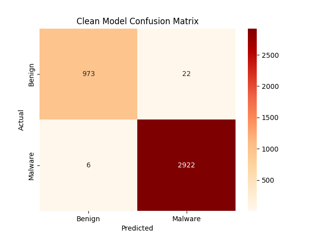
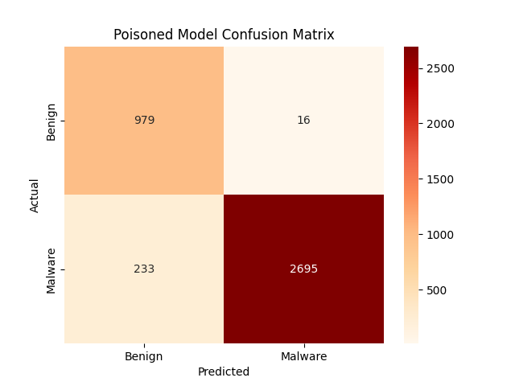
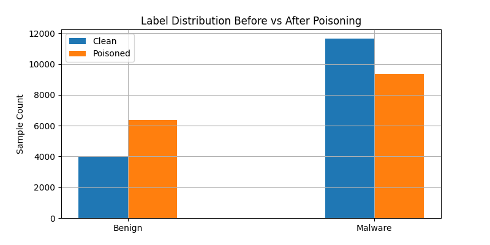
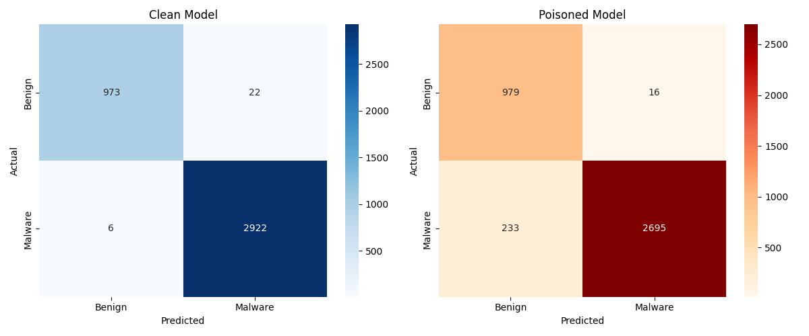

# PRE Requisites
Install requirements.txt file with pip install -r requirements.txt

# First approach.
For the first approach a Dataset from Kaggle containing features from pe (portable executable) files have been analyzed.

https://www.kaggle.com/datasets/amauricio/pe-files-malwares/data

## Table of Features

### 🧠 Common PE Feature Columns and Their Meaning

| **Column Name**              | **Meaning (from PE Format)**                                                                 |
|-----------------------------|----------------------------------------------------------------------------------------------|
| `SizeOfCode`                | Size of the executable code section (`.text`) from the Optional Header                       |
| `SizeOfInitializedData`     | Size of initialized global/static data                                                       |
| `SizeOfUninitializedData`   | Size of `.bss` segment or similar uninitialized data                                          |
| `AddressOfEntryPoint`       | RVA of where program execution begins                                                        |
| `BaseOfCode`                | RVA for the start of the code segment                                                        |
| `ImageBase`                 | Preferred address where the PE should be loaded in memory                                    |
| `SectionAlignment`          | How sections are aligned in memory                                                           |
| `FileAlignment`             | How sections are aligned in the file                                                         |
| `NumberOfSections`          | Total number of sections (e.g., `.text`, `.data`, `.rsrc`, etc.)                             |
| `Characteristics`           | Flags describing file type (executable, DLL, etc.)                                           |
| `MajorOperatingSystemVersion` | Minimum OS version required to run                                                        |
| `Subsystem`                 | Type of interface (e.g., console, GUI)                                                       |
| `DllCharacteristics`        | Security-related flags (e.g., ASLR, DEP)                                                     |
| `SizeOfImage`               | Total memory footprint of the loaded PE file                                                 |
| `SizeOfHeaders`             | Combined size of DOS header, PE header, and section headers                                  |
| `Entropy`                   | Shannon entropy (used to detect packing or obfuscation)                                      |
| `ResourcesMaxEntropy`       | Highest entropy found in the resource section                                                |
| `ImportsNb`                 | Number of imported functions                                                                 |
| `ExportsNb`                 | Number of exported functions                                                                 |
| `LoadConfigurationSize`     | Size of the load configuration directory (used for security features)                        |
| `VersionInformationSize`    | Size of the version info resource block (includes metadata like product version, company)    |

## First approach results.

In order to analyze the poissoning effects a set of plots have been included inside the codebase.

### Clean Model Confusion Matrix


### Poisoned Model Confusion Matrix


### Label Flipping


### Confusion Matrix Comparison



# Second Approach.
Data Poissoning in RAG System.

# Example Execution.
First example.
````
python data_poissoning.py 
````
Second example.
````
python RAG_poisoning.py
````
